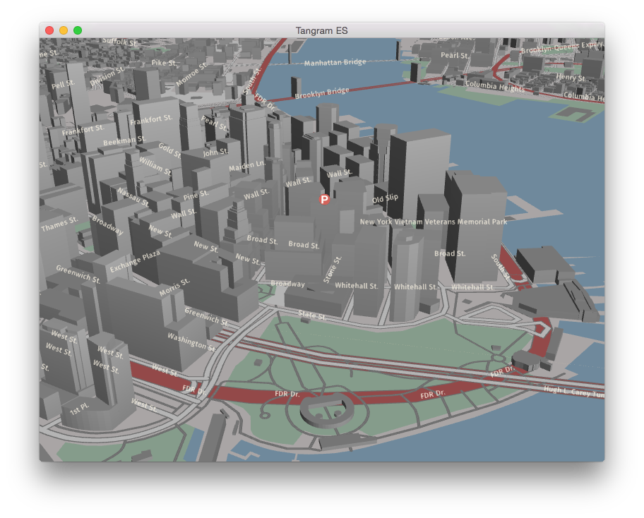

tangram-es
==========

tangram-es is a C++ library for rendering 2D and 3D maps from vector data using OpenGL ES, it is a counterpart to [tangram](https://github.com/tangrams/tangram) focused on mobile and embedded devices.

This repository contains both the core rendering library and sample applications that use the library on Android, iOS, Mac OS X, Ubuntu, and Raspberry Pi.

[](https://gitter.im/tangrams/tangram-chat?utm_source=share-link&utm_medium=link&utm_campaign=share-link)

| Platform                                | Build status                       |
| --------------------------------------- | ---------------------------------- |
| Linux/Android                           | [](https://travis-ci.org/tangrams/tangram-es/builds) |
| iOS | [](https://circleci.com/gh/tangrams/tangram-es) |



*tangram-es is in active development and is not yet feature-complete*

## Platform Targets ##

Currently we are targeting five platforms:

 - [Android](platforms/android)
 - [iOS](platforms/ios)
 - [Mac OS X](platforms/osx)
 - [Ubuntu Linux](platforms/linux)
 - [Raspberry Pi](platforms/rpi)

## Code Style ##

In general, code changes should follow the style of the surrounding code.

When in doubt, you can use the provided clang-format style file for automatic styling.

Install clang-format (available through brew or apt-get):
```
brew install clang-format
```
or
```
sudo apt-get install clang-format
```

Run clang-format with specified style (use -i to modify the contents of the specified file):
```
clang-format -i -style=file [file]
```
