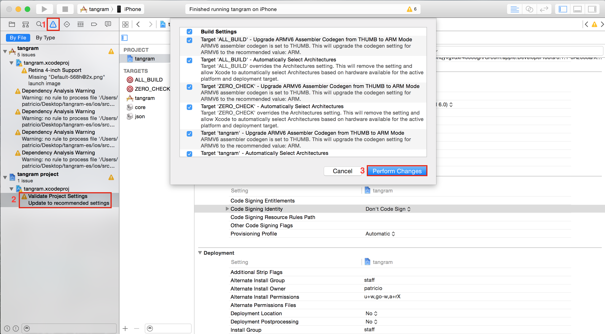

tangram-es
==========


OpenGL ES version of Tangram for mobile devices - EARLY work-in-progress!

tangram-es is a library for rendering 2D and 3D maps using OpenGL ES 2 with custom styling and interactions. We also maintain sample client applications that use the library to render on Android, iOS, and Mac OS X. 

build
=====
This project uses _CMake_ (minimum version **2.8** for all platforms, except iOS platform that uses cmake **3.0**), you can download it [here](http://www.cmake.org/download/) or use your favorite installation package tool like [homebrew](http://brew.sh/).

```bash
brew install cmake
```

Make sure to update git submodules before you build:

```bash
git submodule init && git submodule update
```

Currently we are targeting four platforms: OS X, iOS, Android, and Raspberry Pi. 

## platforms ##

### OS X ###
To build for OS X, you will need to install [GLFW](http://www.glfw.org/): 

```bash
brew tap homebrew/versions
brew install glfw3
```

Then build using GNU Make:

```bash
make osx
```

### iOS Simulator ###
For running on the iOS simulator, generate and compile an XCode project:

```bash
make ios
```

Then just open the Xcode project and run/debug from there: 

```bash
open build/ios/tangram.xcodeproject
```

Note that any Xcode configuration change you make to the project won't be preserved when Cmake runs again. Build configuration is defined only in the CMakeLists file(s).

### iOS Devices ###
For running on iOS devices you will need an iOS developer account, a valid code signing certificate, and a valid provisioning profile. Help on these topics can be found at [Apple's developer website](http://developer.apple.com). 

First generate an XCode project without compiling:

```bash
make cmake-ios IOS_PLATFORM=OS
```

Then open the Xcode project:

```bash
open build/ios/tangram.xcodeproj
```

In the project settings for the target named 'tangram', set 'Team' to your developer account. Now you can build and run the demo on a connected device.

When you run on a device for the first time you may encounter an error with a message similar to:


To fix this, go to the Issues navigator tab in Xcode and click 'Validate Project Settings' under 'tangram.xcodeproj', then allow Xcode to perform any needed changes.



### Android ###
To build for Android you'll need to have installed both the [Android SDK](http://developer.android.com/sdk/installing/index.html?pkg=tools) and the [Android NDK](https://developer.android.com/tools/sdk/ndk/index.html). Set an `ANDROID_HOME` evironment variable with the root directory of your SDK and an `ANDROID_NDK` environment variable with the root directory of your NDK. 

Build an APK of the demo application and optionally specify an architecture (default is armeabi-v7a):

```bash
make android [ANDROID_ARCH=[x86|armeabi-v7a|armeabi]]
```

Then install to a connected device or emulator. You can (re)install and run the APK with a small script:

```bash
./android/run.sh
```

### Raspberry Pi ###

Install a C++11 compatible compiler and libcurl:

```
sudo apt-get install g++-4.7 libcurl4-openssl-dev
```

Then compile and run:

```
make rpi
cd build/rpi/bin
./tangram
```
