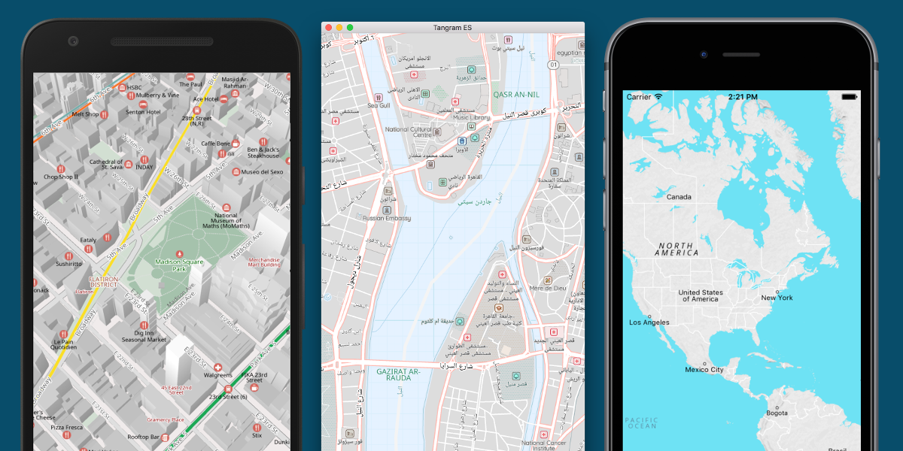

Tangram ES
==========

Tangram ES is a C++ library for rendering 2D and 3D maps from vector data using OpenGL ES. It is targeting mobile and embedded devices. A counterpart to [Tangram](https://github.com/tangrams/tangram).

This repository contains both the core rendering library and sample applications that use the library on Android, iOS, Mac OS X, Ubuntu, and Raspberry Pi.

## Platform Targets

For more information about building Tangram ES or using it in your project, see the individual platform pages below:

- [Android](platforms/android)
- [iOS](platforms/ios)
- [Mac OS X](platforms/osx)
- [Ubuntu Linux](platforms/linux)
- [Raspberry Pi](platforms/rpi)

## Support

For concept overviews and technical reference, see the [Tangram Documentation](https://mapzen.com/documentation/tangram).

You can also find us in the tangram-chat gitter chat room: https://gitter.im/tangrams/tangram-chat

## Contributions Welcome

We gladly appreciate feedback, feature requests, and contributions. For information and instructions, see [CONTRIBUTING.md](CONTRIBUTING.md).

Please note that this project is released with a Contributor Code of Conduct. By participating in this project you agree to abide by its terms. See [CODE_OF_CONDUCT.md](CODE_OF_CONDUCT.md).

Tangram ES was created by [Mapzen](https://www.mapzen.com/) and is now a [Linux Foundation Project](https://www.linuxfoundation.org/press-release/2019/01/mapzen-open-source-data-and-software-for-real-time-mapping-applications-to-become-a-linux-foundation-project/).
