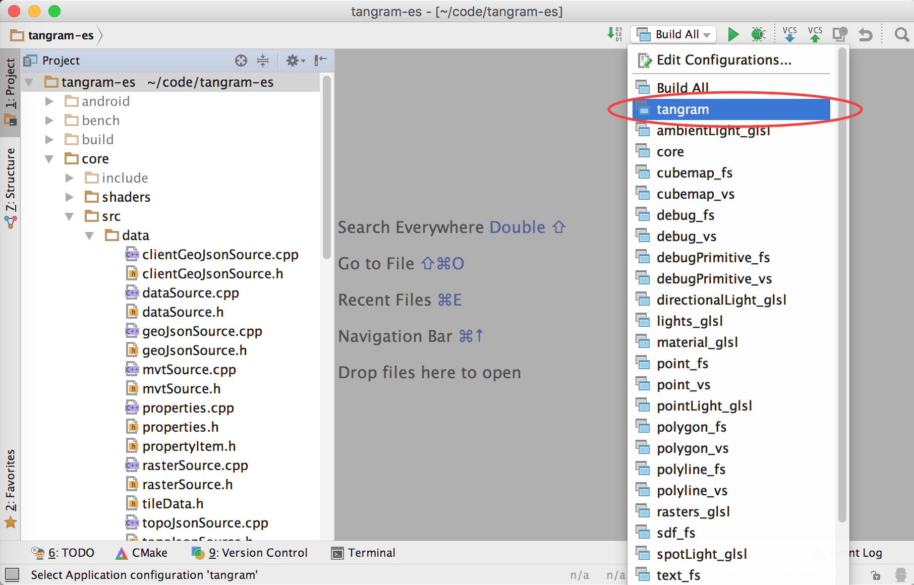

Mac OS X
========

## Setup ##

This project uses CMake (minimum version 3.0), you can download it [here](http://www.cmake.org/download/) or use your favorite installation package tool like [homebrew](http://brew.sh/).

```bash
brew install cmake
```

Make sure to update git submodules before you build:

```bash
git submodule update --init
```

## Build ##

There are several ways you can build the tangram-es library and demo application on Mac OS X:

### Command Line ###

To build a runnable OS X application bundle, run:

```bash
make osx
```

You can optionally use `make -j` to parallelize the build and append `DEBUG=1` or `RELEASE=1` to choose the build type.

Then open the application with:

```bash
open build/osx/bin/tangram.app
```

You can open a different YAML scene file by dragging and dropping it into the window, or passing it as an argument:

```bash
open build/osx/bin/tangram.app/Contents/MacOS/tangram -f /path/to/your/scene.yaml
```

### Xcode ###

For running on OS X from Xcode you will need Xcode version 6.0 or higher. Generate and compile an Xcode project:

```bash
make xcode
```

Then just open the Xcode project and run/debug from there:

```bash
open build/xcode/tangram.xcodeproj
```

Note that any Xcode configuration change you make to the project won't be preserved when CMake runs again. Build configuration is defined only in the CMakeLists file(s).

### CLion ###

You can also run and debug from CLion.

After cloning and updating your git submodules, open CLion and __Import Project from Sources__. Select the root of this repo. Choose __Open Project__. Do not overwrite CMakeLists.txt.

CLion will automatically set everything up, all you have to do is wait a minute for the project to get initialized. Then, select the 'tangram' run configuration and hit run/debug.


